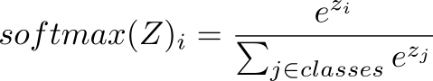
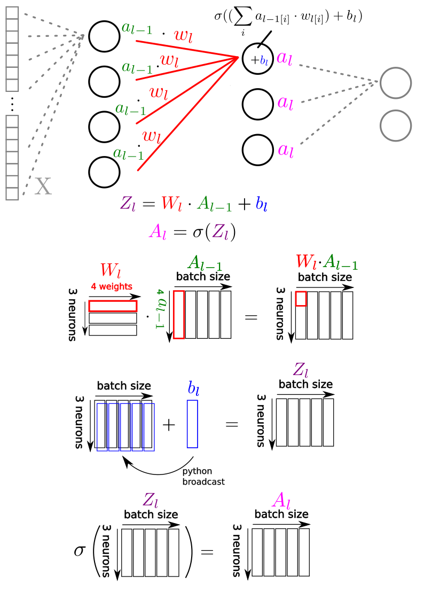
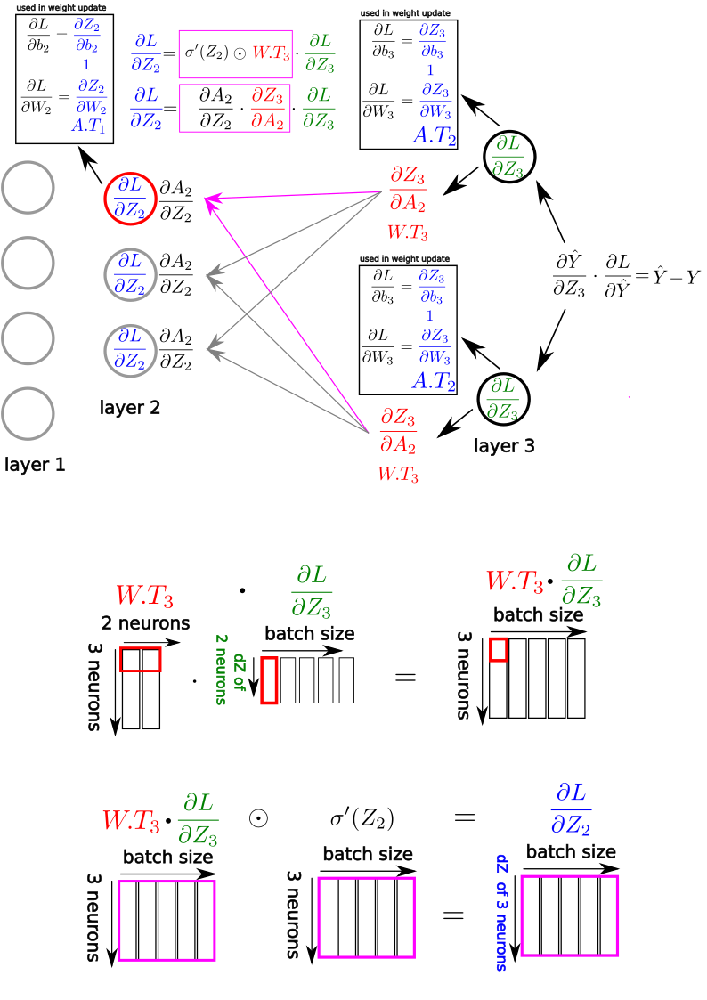

## Vectorized Multi-Layer Perceptron (MLP) from scratch in Python 

### Introduction

In this tutorial I want to share my implementation of a vectorized Multi-Layer Perceptron (MLP) in Python and Numpy without getting help from any ML framework, like Pytorch, Tensorflow, etc. I think that implementing a vectorized neural network completely from scratch is the best way to fully grasp artificial neural networks (ANNs).

Just starting from the vector equations and some theory, coding an MLP from scratch and seeing it becoming alive is quite impressive - and everybody can do it at home, without a sophisticated laboratory!

In this tutorial, I will use the MNIST  dataset [[1]](#references), because it is a small dataset that runs on any machine, and allows us to implement and understand all essential parts of an MLP. However, the MLP could in principle be utilized for more sophisticated datasets. 

>Note: Important theoretical background can be obtained from Andrew Ng's excellent course on Deep Learning [[2]](#references), Ian Goodfellow's famous book [[3]](#references) as well as the initial paper from Geoffrey Hinton et al. [[4]](#references). To me, it was also of great help to learn multivariable calculus to understand the mathematical foundations. One comment concerning notation: In order to explain everything, I am sometimes switching between vector notation and single variable notation.

 

#### Loading the MNIST dataset

First, we open the binary training data file and read the first couple of bytes, according to Yann LeCuns instructions [[1]](#references) . These bytes encode some properties of the dataset, e.g. a magic number (file type identifier), number of training examples, height and width of the pictures:

~~~python
import numpy as np
import matplotlib.pyplot as plt

train_imgs_raw = open("MNIST/train-images-idx3-ubyte", "rb")
print("reading training images...")
magic_number_imgs = int.from_bytes(train_imgs_raw.read(4), byteorder='big')
m_imgs = int.from_bytes(train_imgs_raw.read(4), byteorder='big')
rows_px = int.from_bytes(train_imgs_raw.read(4), byteorder='big')
cols_px = int.from_bytes(train_imgs_raw.read(4), byteorder='big')
~~~

Next, we load the actual pictures into a large numpy array. After reshaping we obtain an array of shape (60000, 784). This is a matrix where each row corresponds to the pixels of one MNIST image. Later, we will transpose the matrix in order to make it more easy to package batches for the MLP. 
 
In order to normalize the dataset, we will also divide all pixels by 255 (all pixels range from 0 - 255 but a normalized value between 0 and 1 will make it much easier for the network to learn something):

~~~python
train_imgs_buf = train_imgs_raw.read(rows_px*cols_px*m_imgs) 
train_imgs_data = np.frombuffer(train_imgs_buf, dtype=np.uint8).astype(np.float32)
train_imgs = train_imgs_data.reshape(m_imgs, rows_px*cols_px)
train_imgs = train_imgs/255
~~~

> **Note:**
Flattening the MNIST image destroys the spatial component of the initially 2-dimensional images. This is one of the reasons why MLPs are limited in real computer vision applications. Convolutional neural networks (CNNs) preserve the 2D component by convolving learnable kernels over the image grid. Thus, CNNs are generally a much better choice for computer vision tasks. This may be a topic of another tutorial.
 
 

#### Visualizing single pictures from the MNIST dataset

If you want to see some of the images, you might want to plot it with the following lines of code:

~~~python
def plot_img(imgs, label_data, num):    
    fig = plt.figure(figsize=(6,6))
    ax = fig.add_subplot()
    ax.set_title("image "+str(num)+"; label: "+str(int(label_data[num])))
    plt.imshow(imgs[num].reshape(28,28), cmap="Greys")
num = 50
plot_img(train_imgs, train_labels, num)
plt.savefig("example_picture_"+str(num)+".png")
plt.close()
~~~

We just go to a specified row and reshape it to the 28 x 28 pixel array to obtain the image:

 

#### Creating batches from the MNIST images

Given a desired batch size the next couple of lines determine how many batches you can get from the total number of images and, subsequently package them into tuples where each sequence of images in a minibatch is aligned with the corresponding labels. 

Firstly, the train_imgs matrix gets transposed, because it makes the subsequent batching easier and yields matrices that can be used by the MLP.

Coding the batching tends to be a bit tedious, because the slicing operations need to be carefully designed to not mess with the order of the images and labels. Therefore, the code below looks a bit complicated. First, we transpose the train_imgs matrix to yield a matrix of shape (784, 60000). After transposition each column corresponds to an image, so we must be careful to leave the columns untouched.
It helps a lot to make a sketch while coding the batching.

~~~python
num_of_imgs = len(train_imgs)            

batch_size = 100
batch_number = num_of_imgs//batch_size

train_imgs = train_imgs.T
batches = []
for i in range(0, batch_number):    
    batch_imgs = train_imgs[:,(i*batch_size):(i*batch_size)+batch_size]
    batch_labels = train_labels[(i*batch_size):(i*batch_size)+batch_size]
    batches.append((batch_imgs, batch_labels))
~~~

Given a batch size of 100, the above lines will yield matrices with shape (784, 100). Again, each column is a single flattened image.
To make the batching process a bit more clear, let's go through the first iterations of the for loop:

~~~python
 #batch_size = 100

 #first batch contains pictures from 0 to 99
train_imgs[:,(0*100):(0*100)+100]
train_imgs[:,0:100] 

 #second batch contains pictures from 100 to 199
train_imgs[:,(1*100):(1*100)+100]
train_imgs[:,100:200]

 #third batch contains pictures from 200 to 299
train_imgs[:,(2*100):(2*100)+100]
train_imgs[:,200:300]

 #...

 #last batch contains pictures from 59900 to 59999
train_imgs[:,(599*100):(599*100)+100]
train_imgs[:,59900:60000]
~~~

 

#### Implementing the Multi-Layer Perceptron 

Now, we are getting to the heart of the program. 

We want to design our network to be initialized by a topology that can be customized:

~~~python
net1 = Net([784, 500, 250, 10], batch_size)
~~~

Before we continue implementing we set up the basic loop to start the training: 

~~~python
epochs = 20
losses = []
for epoch in range(0, epochs):
    loss = 0
    correct_count = 0    
    for idx, batch in enumerate(batches): 
        X, Y = batch                
        Y = np.array(Y, dtype=int)     
        #<LEARNING>
~~~

With epochs we define the number of how many times we want to go through the entire dataset. We also initialize a list "losses" to save the average loss of each round to make a plot afterwards. Plotting the loss can be very helpful in assessing whether our network converges or whether there is a problem. A continuously decreasing loss is a key indicator of a successfully running network.

For each epoch we initialize a loss that will be computed after each forward propagation for the entire batch. We also keep track of how many correct results we got, to compute an accuracy parameter in the end. We then go through the batches and divide it in the minibatch X and the labels Y.

The part that is marked with "\<LEARNING>" is where we need our MLP. Therefore, let's go back to the initialization step:

~~~python
net1 = Net([784, 500, 250, 10], batch_size)
~~~

Layer 1 and the last layer are fixed depending on the dataset.
Because we are dealing with pictures that have 784 pixels, the input needs to be 784. We want to learn a function that maps a handwritten digit to one of 10 classes. 
That is 0,1,2,3,4,5,6,7,8 or 9. Therefore, the last layer is also fixed with the number of classes: 10.
In between those fixed layers, we want our net to be populated  with a customized amount of layers each containing a defined set of neurons. The above architecture of hidden layers with size 500 and 250 has been quite successful in my hands, so I will use it here. But you can test any architecture you like.

The initialization method of our <b>class Net</b> takes the topology (a list of layers) as well as the batch_size. The topology list is utilized to define input_dim and output_dim. 
Then, it generates empty dictionaries to keep track of the arising matrices.

~~~python
def __init__(self, topology, batch_size):        
    self.topology = topology
    self.input_dim = topology[0]        
    self.output_dim = topology[-1]                
    self.layers = [{} for x in range(len(topology))]        
~~~

We now want to populate the net with the following matrices: weights <b>W</b>, biases <b>b</b>, the weighted sums <b>Z</b>, and the resulting activations <b>A</b> of the neurons. For each batch we also keep track of the gradients <b>dW</b>, <b>db</b> and <b>dZ</b>. Keep in mind that the only batch independent matrices are <b>W</b> and <b>b</b>!
Notably, we need to save <b>A</b> for each run because it is an indispensable component for the chain rule to perform gradient descent.

We then loop over the layers.
For each layer  <b>i</b> we first need to know the amount of weights to connect the output of the previous layer. 
In the case of layer 0, we just set W_connections to 1, because we will never use these weights (this is essentially a weight from the input layer, to the previous layer, which - of course - is non-existent).
In the case of layer 1 (the first "real" layer), we want to have one weight for each pixel, therefore we set W_connections to the input dimension.
In all other cases, until the penultimate layer we want the amount of weights to correspond the activations/numbers of neurons of the previous layer(topology[i-1]).

Importantly, we randomly initialize weights W and biases b from the uniform distribution between -1 and 1, which might be a matter of discussion. For more complex classification tasks, one might want to do initialization in a more sophisticated way. Here, the uniform distribution between -1 and 1 will be fine.

On the other hand, Z, A, dW, db and dZ are just initialized with zeros, because these values will differ in each batch anyway:

~~~python
for i in range(0, len(topology)):            
    if i == 0: 
        W_connections = 1 #never used
    elif i == 1:
        W_connections = self.input_dim                    
    else:
        W_connections = topology[i-1]
    
    #parameters                   
    self.layers[i]["W"] = np.random.uniform(-1, 1, (topology[i], W_connections))          
    self.layers[i]["b"] = np.random.uniform(-1, 1, (topology[i],1)) 
    
    #activations
    self.layers[i]["Z"] = np.zeros((topology[i], batch_size))            
    self.layers[i]["A"] = np.zeros((topology[i], batch_size)) 
    
    #gradients
    self.layers[i]["dW"] = np.zeros((topology[i], W_connections))
    self.layers[i]["db"] = np.zeros((topology[i], batch_size))            
    self.layers[i]["dZ"] = np.zeros((topology[i], batch_size))
~~~

For the forward propagation we need the following functions, defined in our class Net:

The first is the sigmoid function, which takes a weighted sum z and outputs a value between 0 and 1. Usually, people take ReLU (Rectified Linear Unit) as an activation function these days, but for this project I just use sigmoid because I think it is easier to explain the calculus with it (but you can easily change that if you want). 
Each neuron of the previous layer computed an activation. We take these activations, multiply them with corresponding weights and add a bias to obtain z. In a vectorized implementation this can be done simultaneously for all neurons and the entire batch by utilizing a dot product.

The value of z can be a wide range of numbers, but we want it to be between 0 and 1. This is everything that the sigmoid function does. Each possible value of z gets projected to a value between 0 and 1, which ensures breaking linearity, a key prerequisite for a neural net to learn:

$$ \sigma(z) = \frac{1}{1+e^{-z}} $$

I am using the single variable notation here, because this function is computed by each neuron.

~~~python
def activation_function(self, z):    
    #sigmoid
    s = 1/(1+np.exp(-z))
    return s
~~~

The sigmoid function is used as an activation function in the entire neural network except the last layer.

In the last layer, we could use a single sigmoid function as an output, if we would be dealing with a binary classification task (e.g. differentiate between presence of class 0 or class 1, like cat or dog).

For classification involving more classes, we need a slightly more sophisticated approach. 
The softmax function takes all the activations of the last layer as an input but instead of summing them together and mapping them to a number between 0 and 1, it generates a probability distribution for each of the classes, that sums up to 1.0:

Let's say the 10 output neurons have the following activations:
~~~console
[-0.95 -0.76  2.18 -0.45 -0.2   0.35  0.13 -0.28 -0.91  0.83]

~~~
We want to convert this into a probability distribution that sums up to 1.0. This can be done by the softmax function:
~~~console
[0.02 0.03 0.52 0.04 0.05 0.08 0.07 0.04 0.02 0.13]
~~~
In this example, the neural network thinks that the digit "2" might be the most probable one, as it shows the highest value (0.52).

The softmax function is given by the following formula and code (I followed the indexing of [[2]](2) but made it a bit more clear that j indexes over all classes):

Important: The output of the softmax is vector-valued, it takes an input vector of len(classes) and <b>outputs a vector of the same length</b>. More specifically, we raise e to the power of the value of each output:  $e^{z_i}$ and divide it by the sum of these values over all classes.

~~~python
def softmax(self, z):            
    exp = np.exp(z)    
    sums = np.sum(exp, axis=0, keepdims=True)    
    res = exp/sums        
    return res
~~~

Now, we need a feedforward function that takes a matrix X and propagates it through all the layers. We keep track of the current layer with the subscript letter $l$. The activations of the previous layers are  denoted $A_{l-1}$ (or the input X for the first hidden layer). 

Doing this is a relatively straightforward process initialized by calling net1.feedforward(X). In vector notation this can be expressed as: 

$$ Z_l = W_l \cdot A_{l-1} + b_l$$

$$ A_l = \sigma(Z_l)$$

 

In the picture below, I tried to make it more clear depicting a very simple MLP. Note, that the matrices are written in capital letters, whereas the elements of the matrices are written in lowercase. The mathematical notation is very abstract. To make it more clear let's assume we are in the middle layer, therefore the activations of the previous layers are labeled "l-1", because from our middle layer perspective it is one layer before. The formula at the top reminds us, that we are dealing with the weighted sum of the activations (realized as a dot product in the matrix operations below).

Whereas the top picture depicts the concept, the lower picture depicts the actual matrix operations that are performed during the forward pass.

~~~python
def feedforward(self, X):                    
    for i in range(0, len(self.topology)-1): 
        
        if i == 0:
            continue            
        elif i == 1:                
            A = X
        else:
            A = self.layers[i-1]["A"]
            
        self.layers[i]["Z"] = np.dot(self.layers[i]["W"], A) + self.layers[i]["b"]  
        self.layers[i]["A"] = self.activation_function(self.layers[i]["Z"]) 
        
    A = self.layers[-2]["A"]
    self.layers[-1]["Z"] = np.dot(self.layers[-1]["W"], A) + self.layers[-1]["b"]          
    self.layers[-1]["A"] = self.softmax(self.layers[-1]["Z"])#
            
    Y_hat = self.layers[-1]["A"]
    
    return Y_hat
~~~

To make the indexing more clear, in the topology/architecture we are using, we have the following setup:

~~~
layers: [784, 500, 250, 10]
len(topology) = 4
len(topology)-1 = 3 = last layer

indexing:
[0, 1, 2, 3] 
[0, 1, -2, -1]
~~~

The loop in the code above does not include the last layer (in our  architecture: layer 3), because we need to "treat" it differently in order to apply softmax. 

Just, like in the other layers, in the last layer we get the activations of the previous layer (the penultimate layer) and generate a weighted sum + bias, which results in Z. But now, we don't apply the sigmoid function, but instead, the 10 resulting values are subjected to the softmax function in order to produce the above mentioned probability distribution.

The resulting activation A of the last layer is returned as Y_hat, because it is the networks guess which class of the handwritten digits is most likely, second most likely, etc. 

Given a batch_size of 100, net1.feed_forward(X) returns a matrix Y_hat that is of shape (10, 100). It contains the probability distributions for each of the 100 images in one batch. 

By using np.argmax we extract the  class with the highest probability for each image:
~~~python
pred = np.argmax(Y_hat, axis = 0)
~~~

We can count the number of correct predictions by: 
~~~python
correct_count += np.sum(pred == Y)
~~~

To prepare the ground truth labels Y for the loss function, we need it in a one-hot fashion to match the Y_hat format.

Therefore, we initialize a zero matrix:

~~~python
Y_oh = np.zeros((10, batch_size), dtype=int)
~~~

Given a batch of size 100, we end with a shape of (10,100) all filled with zeros.
Now, we want to indicate the true category by a 1. This can be done via lazy indexing:

~~~python
Y_oh[Y, np.arange(0, Y.shape[0])] = 1
~~~

Y is an array with a single dimension, providing all the labels. 
np.arange(0, Y.shape[0]) generates a sequence from 0 to the length of Y. The zero filled vector Y_oh gets assigned a 1 in the correct position.

E.g. for the first 5 columns of Y_oh we get:
~~~python
Y_oh[:, 0:5]
array([[0, 1, 0, 0, 0],
       [0, 0, 0, 1, 0],
       [0, 0, 0, 0, 0],
       [0, 0, 0, 0, 0],
       [0, 0, 1, 0, 0],
       [1, 0, 0, 0, 0],
       [0, 0, 0, 0, 0],
       [0, 0, 0, 0, 0],
       [0, 0, 0, 0, 0],
       [0, 0, 0, 0, 1]])
~~~

Column 1 has a 1 in the fifth position, therefore it encodes a label for class "5".

Compare this to the prediction Y_hat of our untrained model (rounded for visualization):

~~~python
Y_hat[:, 0:5].round(2)
array([[0.  , 0.  , 0.  , 0.  , 0.  ],
       [0.  , 0.  , 0.  , 0.  , 0.  ],
       [0.6 , 0.99, 0.89, 1.  , 0.92],
       [0.  , 0.  , 0.  , 0.  , 0.  ],
       [0.  , 0.  , 0.  , 0.  , 0.  ],
       [0.01, 0.  , 0.  , 0.  , 0.  ],
       [0.38, 0.  , 0.11, 0.  , 0.08],
       [0.  , 0.  , 0.01, 0.  , 0.  ],
       [0.01, 0.  , 0.  , 0.  , 0.  ],
       [0.  , 0.  , 0.  , 0.  , 0.  ]])
~~~

The largest value is at 2. Clearly, the net needs to learn a bit more.

Now, comes the math part: 

In order to adjust the neural network we need an error function that we can minimize.
In the case of a multiclass classification task, the Cross Entropy function is commonly used:

$$ loss = -\sum_{i \in classes} (y_i \cdot log(\hat{y}_i)) $$

The code below implements the cross entropy for each sample in the batch and then divides it by the batch_size. It returns the average loss per sample for the entire batch. The epsilon is just added for numerical stability (log(0) is undefined).

~~~python
def calculate_loss(self, Y_hat, Y_oh):
    batch_size = Y_oh.shape[1]
    epsilon = 1e-10
    return (- np.sum(Y_oh*np.log(Y_hat)))/batch_size 
~~~

~~~python
loss += net1.calculate_loss(Y_hat, Y_oh)
~~~
#### Backpropagation
Now, that we computed the loss, we can finally start with the process of backpropagation.

At this point we are at the heart of ML. How can we optimize the classifier?
We need a way to dampen the signal of neurons that contributed to the wrong answer, and to amplify the signal of neurons that contributed to the right answer. To achieve this we rely on calculus and the chain rule. To update the weights in gradient descent, we need the gradient of the loss function with respect to the weights as well as the gradient of the loss function with respect to the biases. We first calculate $\frac{\partial L}{\partial Z}$ in each layer. This can then be used to obtain the gradients for the weights and biases, e.g. for the last layer:

$$ \textcolor{magenta}{\frac{\partial L}{\partial Z}}  = \frac{\partial \hat{Y}}{\partial Z}\frac{\partial L}{\partial \hat{Y}}$$

$$ \frac{\partial L}{\partial W} = \frac{\partial Z}{\partial W} \textcolor{magenta}{\frac{\partial L}{\partial Z}}$$

$$\frac{\partial L}{\partial b} = \frac{\partial Z}{\partial b} \textcolor{magenta}{\frac{\partial L}{\partial Z}}$$

These formula look a bit complicated and it takes some time to get behind them, but the idea is really straightforward. To me, it helps a lot to read the formula from <u>right to left</u>. We start with the gradient of the loss function with respect to $\hat{Y}$, which is denoted by $\frac{\partial L}{\partial \hat{Y}}$.

Whereas the loss itself has been computed above, we now need to compute the gradients.
In order to do that, we need to compare the prediction $\hat{Y}$ with the ground truth label $Y$. Therefore, the backprop function takes both as an argument. 

~~~python
net1.backprop(Y_hat, Y_oh, lr=0.01)
~~~

The most unintuitive part comes at the start: whereas backpropagation is very intuitive when dealing with the sigmoid function it is a bit more complicated at the beginning, where we utilize the softmax function, which is vector-valued.

In fact, we can combine the first two steps of backpropagation into a single step.

Its derivation is quite involved and not in the scope of this tutorial (it utilizes an advanced concept of multivariable calculus, the Jacobi matrix of vector-valued functions), but boils down to:

$$ \frac{\partial L}{\partial Z} = \frac{\partial \hat{Y}}{\partial Z}\frac{\partial L}{\partial \hat{Y}}$$

$$ = \frac{\partial}{\partial Z}(\frac{e^{z_i}}{\sum_{j\in classes}^{}e^{z_j}}) \cdot \frac{\partial}{\partial \hat{Y}}(-\sum_{i \in classes} (Y_i \cdot log(\hat{Y}_i))) = \hat{Y} - Y $$

Again, the i in the softmax enumerator $e^{z_i}$ denotes the inputs to the softmax.

As you can see, obtaining the gradient of the last layer is pretty straightforward and basically computed by just subtracting the label $Y$ from the prediction $\hat{Y}$.

Therefore, I didn't even implement a separate function, but just compute it in the first line of the backpropagation pass:

~~~python
def backprop(self, Y_hat, Y_oh, lr=0.01):                
    #last_layer                
    self.layers[-1]["dZ"] = Y_hat - Y_oh    
~~~

For all the other layers, we need to obtain the derivative of the sigmoid function. This can be done by calculus:

$$ \sigma(z) = \frac{1}{1+e^{-z}} $$

$$ \frac{\partial}{\partial z} \sigma(z) = \frac{\partial}{\partial z}(\frac{1}{1+e^{-z}}) $$

$$ = \frac{\partial}{\partial z}((1+e^{-z})^{-1}) = -1(1+e^{-z})^{-2}(-e^{-z}) = \frac{e^{-z}}{(1+e^{-z})^2}$$

$$ = \frac{e^{-z}}{(1+e^{-z})}\frac{1}{(1+e^{-z})}$$

$$ = (\frac{(1+e^{-z})-1}{(1+e^{-z})})\frac{1}{(1+e^{-z})}$$

$$ = (\frac{(1+e^{-z})}{(1+e^{-z})}-\frac{1}{1+e^{-z}})\frac{1}{1+e^{-z}}$$

$$ = (1 - \frac{1}{1+e^{-z}})\frac{1}{1+e^{-z}}$$

$$ = (1 - \sigma(z))\cdot\sigma(z) = \sigma'(z)$$

~~~python
def activation_function_derivative(self, z):    
    #sigmoid_derivative        
    s = self.activation_function(z)*(1 - self.activation_function(z))
    return s
~~~

We can get all gradients by simply differentiating the vector formulas we mentioned in the forward path:

$$ Z_l = W_l \cdot A_{l-1} + b_l$$

$$ A_l = \sigma(Z_l)$$

Let's write down all derivatives we need:

$$ \frac{\partial}{\partial W_l}(W_l \cdot A_{l-1} + b_l) = A_{l-1}$$

$$ \frac{\partial}{\partial A_{l-1}}(W_l \cdot A_{l-1} + b_l) = W_l$$

$$ \frac{\partial}{\partial b_l}(W_l \cdot A_{l-1} + b_l) = 1$$

$$ \frac{\partial A_l}{\partial Z_l} = \sigma'(Z_l)$$

$$ \frac{\partial Z_{l+1}}{\partial A_l} = W_{l+1}$$

 

With this, we can assemble an essential formula that links the layers during backpropagation ($\odot$ = element-wise multiplication):

$$ \frac{\partial L}{\partial Z_{l}} = \frac{\partial A_l}{\partial Z_{l}}\cdot\frac{\partial Z_{l+1}}{\partial A_l}\cdot\frac{\partial L}{\partial Z_{l+1}} $$

$$ \textcolor{magenta}{\frac{\partial L}{\partial Z_{l}}} = \sigma'(z)\odot W.T_{l+1}\cdot\frac{\partial L}{\partial Z_{l+1}} $$

Then, we can also derive formulas to get the gradient of the loss function with respect to the weights.

$$ \frac{\partial L}{\partial W_{l}}=\frac{\partial Z_l}{\partial W_{l}}\cdot\textcolor{magenta}{\frac{\partial L}{\partial Z_{l}}} $$

$$ \frac{\partial L}{\partial b_{l}}=\frac{\partial Z_l}{\partial b_{l}}\cdot\textcolor{magenta}{\frac{\partial L}{\partial Z_{l}}} $$

At this point let's try to visualize again with a sketch. Looking at the picture below, we can already tell that the backpropagation step is a little bit more complicated than the forward pass. Again, mathematical notation is usually very general. Therefore, to make it clear, we  enumerate the layers from layer 0 (input layer) to layer 3 (output layer). We can now start backpropagating at the end of the neural net: Here, the loss w.r.t. $Z$ is computed slightly different, due to the softmax function, as explained above. Once, we have computed the gradient of the loss w.r.t. $Z_3$ (last layer), it gets a little simpler.
The most important point is, that we calculate the gradient of the loss function w.r.t. $Z$ for each neuron and link it to the previous layer by the gradient of $Z$ w.r.t. $A_{prev}$, which is simply the weights of the current layer. By transposing the weights we can use matrix multiplication. The resulting matrix has a shape that aligns with $Z$ and $A$ of the previous layer. 
We can then use element-wise multiplication with the gradient of the activation function $\sigma'(Z)$, to obtain the gradient of the loss function w.r.t. $Z$. I prefer using $\odot$ here, because element-wise multiplication is a very different operation than matrix multiplication.

In the second part of the picture you can see the involved matrix operations and how the gradient of the loss function w.r.t. $Z$ is bridging the different layers with both the gradient of Z w.r.t. $A_{prev}$, as well as the gradient of the activation function. 

Chain rule reminder: A consequence of the chain rule is, that enumerators and denominators cancel out e.g. the $Z_3$ in: $\frac{\partial Z_3}{\partial A_2}\cdot\frac{\partial L}{\partial Z_3}$.
It is also important to note, that the arrows in the image below can be thought of as implying matrix multiplications.

 

 
 

#### Weight update

After we calculated the gradients for all layers, the only thing we are left to do is the weight update, where $\alpha$ is the learning rate (often times 0.01 is a good start):

$$ W_{updated} = W - (\alpha \cdot \frac{\partial L}{\partial W}) $$

$$ b_{updated} = b - (\alpha \cdot \frac{\partial L}{\partial b}) $$

Putting the formulas into code, we get:

~~~python
def backprop(self, Y_hat, Y_oh, lr=0.01):                
        #last_layer                
        self.layers[-1]["dZ"] = Y_hat - Y_oh        
        self.layers[-1]["dW"] = np.dot(self.layers[-1]["dZ"], self.layers[-2]["A"].T)        
        self.layers[-1]["db"] = np.mean(self.layers[-1]["dZ"],axis=1, keepdims=True)
        
        #all other layers
        for i in range(len(self.topology)-2, 0,-1):                         
            self.layers[i]["dZ"] = np.dot(self.layers[i+1]["W"].T, self.layers[i+1]["dZ"])*self.activation_function_derivative(self.layers[i]["Z"])                        
            self.layers[i]["dW"] = np.dot(self.layers[i]["dZ"], self.layers[i-1]["A"].T)                        
            self.layers[i]["db"] = np.mean(self.layers[i]["dZ"],axis=1, keepdims=True)
        
        #weight update
        for i in range(0, len(self.topology)):             
            if i == 0:
                continue                                    
            self.layers[i]["W"] = self.layers[i]["W"] - (lr * self.layers[i]["dW"])
            self.layers[i]["b"] = self.layers[i]["b"] - (lr * self.layers[i]["db"])
~~~

#### Running the MLP

Now, we can complete our loop from above:

~~~python
epochs = 20
losses = []
for epoch in range(0, epochs):
    loss = 0
    correct_count = 0    
    for idx, batch in enumerate(batches): 
        
        X, Y = batch        
        
        Y = np.array(Y, dtype=int)                
        
        Y_hat = net1.feedforward(X)        
                        
        pred = np.argmax(Y_hat, axis = 0)
        
        correct_count += np.sum(pred == Y)
        
        Y_oh = np.zeros((10, batch_size), dtype=int)
        
        Y_oh[Y, np.arange(0, Y.shape[0])] = 1        

        loss += net1.calculate_loss(Y_hat, Y_oh)
        
        net1.backprop(Y_hat, Y_oh, lr=0.01)

    avg_loss = loss/batch_number
    accuracy = correct_count/num_of_imgs
    print("epoch", epoch,"\t\t avg_loss:", avg_loss.round(3), "\taccuracy: ", accuracy.round(3))    
    losses.append(avg_loss)
accuracy = correct_count/num_of_imgs
print("last epoch", epoch,"\t\taccuracy:", accuracy)    
  
~~~

If everything works out, we expect the output of the average loss and accuracy for each epoch:

~~~bash
epoch 0 	 avg_loss: 0.93 	accuracy:  0.804
epoch 1 	 avg_loss: 0.283 	accuracy:  0.913
epoch 2 	 avg_loss: 0.22 	accuracy:  0.933
epoch 3 	 avg_loss: 0.183 	accuracy:  0.944
epoch 4 	 avg_loss: 0.157 	accuracy:  0.952
epoch 5 	 avg_loss: 0.136 	accuracy:  0.958
...
~~~

We can already tell that there is a decent decrease of the loss as well as an increasing accuracy. 
Plotting the loss over the epochs confirms that our MLP works perfectly fine:

In fact after 20 epochs of training we achieve an accuracy of > 0.99 on the train set:
~~~bash
last train set epoch (19):	accuracy: 0.9933
~~~

If you look into the code you will also find the test set run. 
During the test run, we only make use of the forward pass.

Because it is very similar, and we covered everything already, I will not go through the test set pass. 

But, we are lucky, as we score > 0.95 also in the test set run:

~~~python
accuracy on test set 0.9531
~~~

Therefore, our net is generalizing good to unknown data and did not overfit to the train set.

#### Summary

We developed an MLP from scratch in Python and numpy without help from any deep learning libray, including deriving most of the mathematical formulas ourselves.

### References

<a id="1">[1]<a/> http://yann.lecun.com/exdb/mnist/

<a id="2">[2]<a/> https://www.coursera.org/specializations/deep-learning

<a id="3">[3]<a/> https://www.deeplearningbook.org/contents/mlp.html

<a id="4">[4]<a/> https://stanford.edu/~jlmcc/papers/PDP/Volume%201/Chap8_PDP86.pdf

